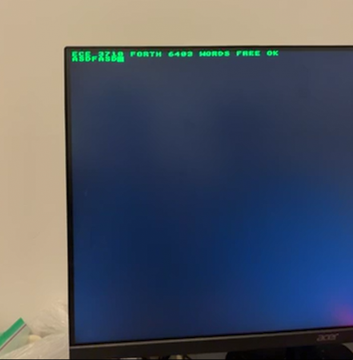
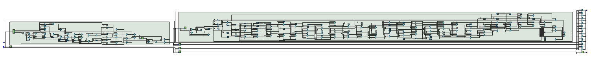
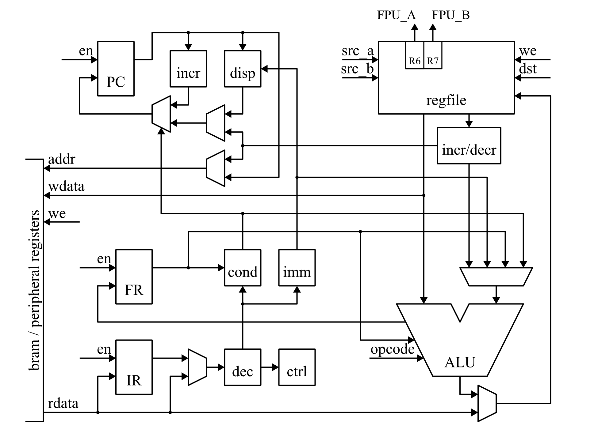
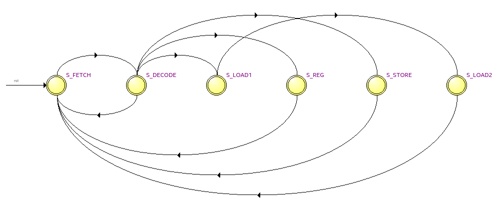
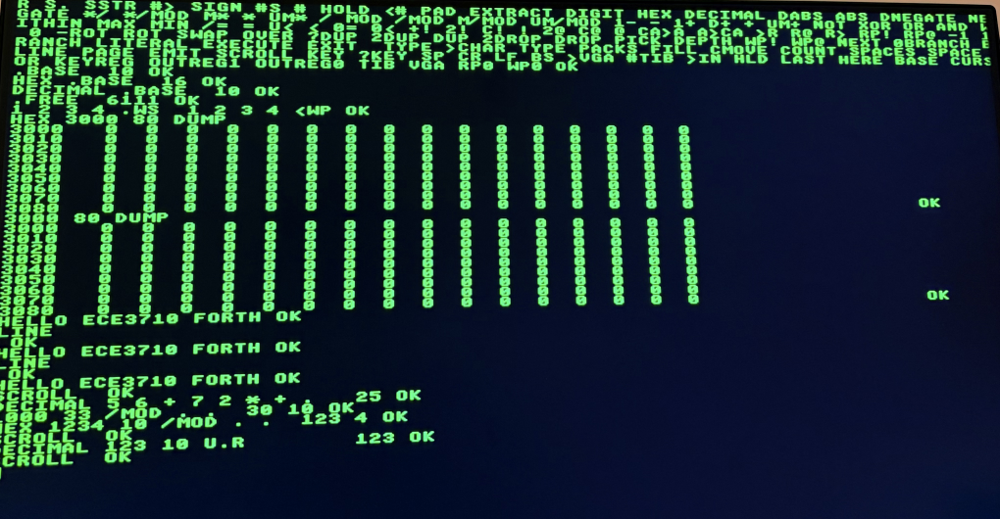
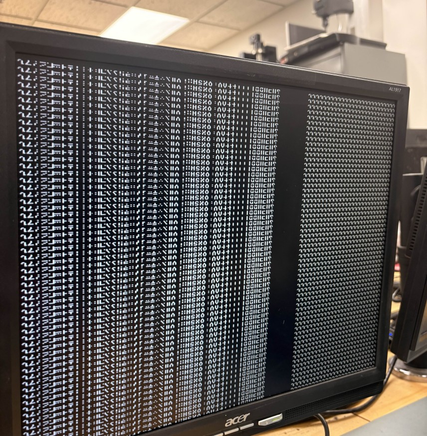
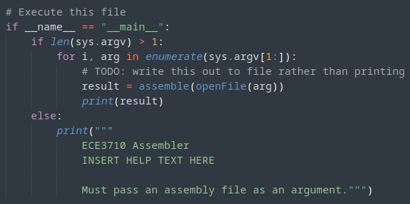

# Final Report - Forth Interpreter and FPU coprocessor
###### Four Pretty Good Academics (Team 6), 12/10/25
- Byron Stewart
- Luke Stillings
- Matt Lee
- Sean Moon


#### Abstract

Our project implements an interactive Forth interpreter and floating-point coprocessor on an FPGA, integrating a custom 16-bit RISC CPU with a VGA text terminal and PS/2 keyboard interface. The system supports interactive Forth programming, without relying on a host computer. User keystrokes are captured through a PS/2 scancode decoder and forwarded into the interpreter’s text buffer, while the VGA subsystem renders an 80×60 character display using an 8×8 bitmap font stored in ROM. A memory-mapped I/O design unifies CPU access to peripherals, allowing Forth software to manipulate the cursor, text buffer, and keyboard input as if they were ordinary memory locations. The design also incorporates a Takum-based floating-point coprocessor, providing an experimental but functional numerical interface.

#### Introduction

The goal of our project was to allow users to write and execute Forth programs directly on our hardware, without a host PC. Achieving this required developing a reliable keyboard interface, a VGA text display, and an efficient Forth interpreter running on our 16-bit RISC CPU. We also wanted hardware support for floating point arithmetic as an extra suppliment to the above functionality.

Our system includes a PS/2 keyboard interface, a VGA text terminal, a memory-mapped I/O architecture, and a Takum-based floating-point coprocessor. Together, these components form a self-contained hardware environment capable of running, displaying, and interacting with Forth code in real time. The result demonstrates the versatility of FPGA-based system design and the power of integrating hardware and software in a single platform.

#### Hardware and System Organization

Our final product has a PS/2 keyboard and a VGA display as peripherals.

##### PS2

We implemented a PS/2 keyboard as a peripheral. The PS/2 module synchronizes both the PS/2 clock and data lines through multiple flip-flops to avoid metastability. It captures 11-bit packets (start bit, 8 data bits, parity, stop bit), shifts them into a packet register, and outputs the scan code to the CPU. The CPU polls the corresponding memory-mapped register and forwards characters into the input buffer for Forth interpreter to parse.
To support this, the keyboard interface includes:
- A falling-edge detector for the PS/2 clock
- A shift register for assembling incoming bits
- A bit counter tracking packet progress
- A parity checker to detect transmission errors
- A new_scan_code flag that pulses when a byte is complete
The memory-mapped interface exposes:
    * KEYREG (`0x4002`): latest scan code
    * KEYFLAG (implicit): indicates whether a new code is available
    * CURSOR (`0x4003`): cursor position control
From the CPU's perspective, reading the peripheral is as simple as: `LOAD R1, [KEYREG]`, and the interpreter uses this to build lines of input inside the input buffer. Handling multi-byte sequences (like key releases and special keys) requires carefully ignoring F0 break codes, which the module filters out before forwarding.

##### VGA



Additionally, we implemented a complete VGA subsystem. The VGA output uses:

- Horizontal and vertical counters
- A character grid resolution of `80`x`60` characters
- An `8`x`8` glyph ROM containing ASCII font bitmaps
- A VGA text buffer stored in BRAM

Every clock cycle, the VGA controller computes the current pixel's row and column, determines which character cell it belongs to, and reads the appropriate glyph bits from ROM. This allows a full text terminal experience driven directly from our hardware.
A cursor register lets the Forth interpreter highlight one of the character locations on the screen so that the user can see their current input position on the screen.

To support readable output, we designed:
- 25 MHz pixel clock generation from a 50 MHz input clock
- Sync pulse timing following the VGA 640x480 @ 60 Hz specification
- Front/back porch timing for proper monitor alignment
- A memory model where VGA continuously reads from the text buffer while the CPU writes to it

The VGA text buffer layout:
- 80 columns x 60 rows = 4800 characters
- Each character = 1 byte ASCII
- CPU writes directly into VGA text buffer memory space
- VGA reads glyph ROM using the character code as an index
The glyph ROM stores each 8x8 bitmap in 8 rows x 1 byte/row format, allowing efficient addressing like so:

```
bit_index = column_within_cell
glyph_address = ascii_code * 8 + row_within_cell
```

This architecture creates a simple and robust text terminal suitable for displaying Forth output, debugging messages, and user-typed input.

#### CPU Interaction With Peripherals:

The CPU accesses the PS/2 keyboard input, VGA cursor, and VGA text buffer through memory-mapped I/O. Each peripheral occupies a fixed address range decoded by an address decoder. For example:

```
VGA0		0x3000	Start of VGA text buffer
KEYREG		0x4002	Latest PS/2 scan code
CURSOR		0x4003	Cursor location
```

When executing, the address decoder determines whether a memory access targets BRAM or a peripheral based on top address bits. This unified approach allows the Forth interpreter to treat peripherals as standard memory locations, simplifying software.

In addition to simple memory-mapped reads and writes, the CPU must coordinate with each peripheral's timing and protocol requirements. Although all peripherals appear to software as ordinary memory locations, the underlying hardware implements specialized behavior. For example, the PS/2 module operates as an asynchronous receiver driven by the keyboard's clock. When the CPU performs a load from KEYREG, it is effectively reading a latched scan code that was captured by the PS/2 state machine. The CPU does not need to wait for serial communication; the peripheral already stores any new scan code before the CPU reads it.

VGA communication works differently. The VGA controller continuously reads characters from the text buffer stored in BRAM beginning at address 0x3000 while updating the pixel output at the 25 MHz pixel clock. Because VGA refresh is independent from CPU execution, the CPU can update the text buffer at any time without interfering with display timing. Each store instruction writing into the text buffer immediately changes the data that the VGA unit reads on the next refresh cycle, allowing Forth programs to produce text output simply by storing ASCII values into memory.

This unified, memory-mapped design ensures that all peripherals: PS/2, VGA cursor, and VGA text buffer are accessed through the same load/store instruction pathway. No special I/O instructions are needed, which simplifies both the CPU architecture and the Forth interpreter software.

#### Takum Arithmetic Floating Point Unit


*Source for image: [takum.org](takum.org)*

Takum is specified as both a linear and logarithmic format, but logarithmic is more supported, so this is what we chose. One of the persuasive factors for choosing this project was that we saw the sample specification [1] had files for the 4 basic arithmetic operations, and assumed we could simply implement those C functions in hardware. Only after further further investigation did we realize that multiplication/division requires IEEE-754 for intermediate calculations there was **no specified algorithm for addition/subtraction**. After emailing the author of the format, he suggested we just used IEEE-754 and convert back to Takum.

Because the focus during the project presentation was only on the Takum format, we incorporated an existing IEEE-754 converter and adder. We used it in the multiplication/division algorithm, as well as direct output (to verify connections are correct and such). We had confusion with different functions used in the `libtakum` specification. It seemed like there was a different encoding/decoding logic when the original code casts number as opposed to when it calls `takum_16_from_l`. We were expecting the former style, based on the main paper, so implemented that one first, and only considered the latter after further consultation. There was confusion over a 'barred logarithmic format', and to what extent converting to a logarithmic format *before* converting to Takum was different than computing the format itself.

There exist VHDL RTL specifications for the encoding process only [2], and we included them in the project for the testbenches. We modified them to compare the VHDL RTL against our implementation, and it seems to pass just fine. There was a VHDL architectural behavior, but we threw it out because it was giving errors and we can assume that the VHDL original matches the specification.

Compiling `FPU.v` as a top-level module reveals the following stats: 2509 ALUTs, 11281 total fanout, and 1729 ALMs needed. Using the timing analyzer, we see that the largest net delay is 87.313ns from `arg1[14]` to `fpu_result[15]`; passing through 55 logic levels. This likely implies that the regime calculation (bits [15:14] in the Takum output) has the largest delay. More importantly, it implies our maximum clock for the entire circuit should be less than 11.4MHz (or else we face metastability with the FPU). If we were to make the FPU part of the instruction set, the clock speed would have to be even lower to account for the control logic.



There surely exist more efficient implementations of this unit if we were to carefully study the format and devise our own algorithm, rather than ham-fistedly reimplement the specification optimized for C. However, this is definitely outside the scope of this project; especially as the FPU is only an ancillary focus.

The low performance of the FPU necessitates special treatment from the rest of the ALU, as it would take much more than 1 cycle to execute. One option would be to delay execution for an amount of time in the control unit, but this would have required a lot of engineering. Another would be to hack NOPs into the assembler after an FPU call, but is inelegant and also has datapath concerns.

One final concern was the difficulty of converting a Takum number back to a readable format. The formula to do this [1] is very difficult to understand, let alone implement. However, we already had a decoder back to IEEE-754, and we were planning on writing the Takum output to a register in the regfile and writing a Forth script to display a 16-bit float.

Although we have tested converting and deconverting from IEEE-754, we are unsure how to test the actual multiplication without including an RTL IEEE-754 multiplication module. As such, we are only *pretty sure* the Takum multiplier works as intended, and would be concerned that applying one more conversion would lead to inprecision. This was paired with the difficulty of writing a number formatter in Forth and the prospect of redesigning the regfile memory to include a write/read register, which threw some synthesis errors. We finally decided to just display the raw Takum bits on the 7-segment. This decision was also influenced by time constraints, as we prioritized testing and integration.

If we had more time to thoroughly test the unit, we would have gone with the original idea.

#### Examples of Operation

Our CPU implements three kinds of instructions. These are register-to-register instructions, memory load instructions, and memory store instructions. Register-to-register and memory store instructions take three clock cycles to execute, and memory load instructions take four clock cycles to execute.

Our CPU reads and writes 16-bit words from a block-RAM. Instructions are read from memory during the first and second clock cycles of an instruction. During a load instruction data is read from memory on the third clock cycle. The program counter, register file, and memory are all written back to during the last clock cycle of an instruction. To support the FPU, registers 6 and 7 have a direct read-only wire coming out of the regfile; bypassing the rest of the datapath. The main internal datapath is described in `datapath.v` and diagrammed below:



The list of instructions is contained in `../instructionList.md`, or quoted below:

```
| Mnemonic  | Operands      | 15-12 | 11-8  | 7-4   | 3-0   | Notes |
| --------- | ------------- | ----- | ----- | ----- | ----- | ----- |
| ADD       | Rdst Rb       | 0000  | dst   | 0101  | b     | |
| ADDI      | Rdst imm      | 0101  | dst   | imm   | imm   | imm sign-extended |
| ADDC      | Rdst Rb       | 0000  | dst   | 0111  | b     | |
| ADDCI     | Rdst imm      | 0111  | dst   | imm   | imm   | imm sign-extended |
| SUB       | Rdst Rb       | 0000  | dst   | 1001  | b     | |
| SUBI      | Rdst imm      | 1001  | dst   | imm   | imm   | imm sign-extended |
| CMP       | Ra Rb         | 0000  | a     | 1011  | b     | |
| CMPI      | Ra imm        | 1011  | a     | imm   | imm   | imm sign-extended |
| AND       | Rdst Rb       | 0000  | dst   | 0001  | b     | |
| ANDI      | Rdst imm      | 0001  | dst   | imm   | imm   | imm zero-extended |
| OR        | Rdst Rb       | 0000  | dst   | 0010  | b     | |
| ORI       | Rdst imm      | 0010  | dst   | imm   | imm   | imm zero-extended |
| XOR       | Rdst Rb       | 0000  | dst   | 0011  | b     | |
| XORI      | Rdst imm      | 0011  | dst   | imm   | imm   | imm zero-extended |
| MOV       | Rdst Rsrc     | 0000  | dst   | 1101  | src   | |
| MOVZI     | Rdst imm      | 1101  | dst   | imm   | imm   | imm zero-extended |
| MOVSI     | Rdst imm      | 1110  | dst   | imm   | imm   | imm sign-extended |
| MOVUI     | Rdst imm      | 1111  | dst   | imm   | imm   | |
| LSHLI     | Rdst imm      | 1000  | dst   | 0000  | imm   | |
| LSHRI     | Rdst imm      | 1000  | dst   | 0001  | imm   | |
| ASHLI     | Rdst imm      | 1000  | dst   | 0010  | imm   | |
| ASHRI     | Rdst imm      | 1000  | dst   | 0011  | imm   | |
| LOAD      | Rdst Raddr    | 0100  | dst   | 0000  | addr  | |
| LOADD     | Rdst Raddr    | 0100  | dst   | 0010  | addr  | Raddr pre decremented |
| LOADI     | Rdst Raddr    | 0100  | dst   | 0011  | addr  | Raddr post incremented |
| STOR      | Rsrc Raddr    | 0100  | src   | 0100  | addr  | |
| STORD     | Rsrc Raddr    | 0100  | src   | 0110  | addr  | Raddr pre decremented |
| STORI     | Rsrc Raddr    | 0100  | src   | 0111  | addr  | Raddr post incremented |
| Scond     | Rdst          | 0100  | dst   | 1101  | cond  | |
| Bcond     | disp          | 1100  | cond  | disp  | disp  | disp sign-extended |
| Jcond     | Raddr         | 0100  | cond  | 1100  | addr  | |
| JAL       | Rdst Raddr    | 0100  | dst   | 1000  | addr  | |
| WAIT      |               | 0000  | 0000  | 0000  | 0000  | |

| Mnemonic  | 3-0   | Description               | Flags |
| --------- | ----- | ------------------------- | ----- |
| EQ        | 0000  | equal                     | Z=1 |
| NE        | 0001  | not equal                 | Z=0 |
| CS        | 0010  | carry set                 | C=1 |
| CC        | 0011  | carry clear               | C=0 |
| HI        | 0100  | higher than               | L=0 |
| LS        | 0101  | lower than or same as     | L=1 or Z=1 |
| GT        | 0110  | greater than              | N=0 |
| LE        | 0111  | less than or equal        | N=1 or Z=1 |
| FS        | 1000  | flag set                  | F=1 |
| FC        | 1001  | flag clear                | F=0 |
| LO        | 1010  | lower than                | L=1 |
| HS        | 1011  | higher than or same as    | L=0 or Z=1 |
| LT        | 1100  | less than                 | N=1 |
| GE        | 1101  | greater than or equal     | N=0 or Z=1 |
| UC        | 1110  | unconditional             | |
|           | 1111  | never                     | |
```

The most interesting instructions in our CPU are the load and store instructions. We augmented these instructions to support pre-decrementing and post-incrementing the register holding the memory address. This modification did not change the number of clock cycles required to execute these instructions.

Load instructions take 4 clock cycles to execute, and store instructions take 3 clock cycles to execute. During the third clock cycle of both of these instructions, the register holding the memory address is optionally decremented and applied to the memory address while also being optionally incremented and written back into the register file at the end of the clock cycle. The state-transition-graph of our CPU control FSM is shown below. Each of the below states corresponds to one cycle of execution:



#### Software - Forth

We implemented an interactive Forth interpreter. Forth is a programming language where programs are composed of a list of subroutines, called words, which pass information implicitly on a dedicated working stack. Our interactive Forth interpreter lets the user enter one line of text at a time into a text terminal displayed on a VGA display using a PS/2 keyboard.



Our Forth interpreter comes with 147 builtin words. Of these words, 47 are primitive words written in assembly, 81 are high-level words written in Forth (as a list of word addresses in our assembly file), 7 are variables, and 12 are constants. This set of words forms a reasonably complete and standard Forth environment with the notable exception of words for defining new user-defined words.

Our interpreter was written in assembly and assembled using our own assembler. The memory map of our system is as follows:
- `0x0000...0x1FFF`: Interpreter program and data
- `0x2000...0x2FFF`: Working stack (growing up) and return stack (growing down)
- `0x3000...0x3BFF`: VGA text memory
- `0x3C00...0x3FFF`: Terminal input buffer
- `0x4000...0x4003`: Memory-mapped registers
- `0x4004...0xFFFF`: Unused

Our interpreter implements a virtual Forth machine which has 8 registers. There is the execution pointer register (**EP**) which points to the next Forth word to execute, there are 4 working registers (**RW, RX, RY, RZ**) which are used by some of the builtin Forth words, there are 2 stack pointer registers (**WP, RP**) which are used to implement the in-memory working stack and return stack, and there is a working stack top register (**WT**) which holds the top item of the working stack.

We implemented a Forth machine in software instead of implementing a Forth machine in hardware because the purpose of this class was to design and implement a 16-bit RISC CPU, augment this CPU with some peripherals, and create an interesting application that runs on the CPU. Even though we implemented a Forth machine for our interpreter in software, we made a simple modification to our RISC CPU to improve the performance of our interpreter.

The modification we made to our RISC CPU was to augment the load and store instructions so that they could automatically pre-decrement or post-increment the register holding the memory address. We were able to make this modification without changing the number of clock cycles required by our load and store instructions. This lets our interpreter manipulate the stacks, which are stored in memory, using a single load/store instruction without requiring an additional instruction to increment or decrement the stack pointer register.

To further reduce the performance impact of the frequent stack operations required by our Forth interpreter, we stored the top item of the working stack in a register. Many of the Forth words in our system take two parameters from the stack and return one result. Storing the top of the stack in a register means these Forth words only need to pop one operand from the stack and can leave the result in the working stack top register.

The Forth words in our system are composed of a 16-bit name pointer which points to the name string of the word, a 16-bit link pointer which points to the link pointer of the previous word in the system, a 16-bit code pointer which points to the machine code that executes that word, and an arbitrary length body which contains data associated with that word. This linked list of words is called the Forth dictionary and is how our interpreter finds the words that the user has typed in.

To make assembling the Forth dictionary easier and less error-prone, we added a macro substitution pass to our assembler. This macro pass allowed us to write custom macros with parameters that are expanded by the assembler before assembling. This allowed us to express frequently repeated assembly instructions using a single macro invocation instead of manually rewriting these assembly instructions hundreds of times.

#### System Integration

At the top level, our system ties together our RISC CPU, on-chip BRAM, VGA text subsystem, PS/2 keyboard interface, and the Takum FPU using register 6 and register 7 through a shared 16-bit address and data bus. An address decoder decodes the upper address bits to decide whether a memory access targets the BRAM, the VGA text buffer, the terminal input buffer, or one of the memory-mapped I/O registers. This allows the CPU to communicate with all peripherals using the same load and store instructions that it uses for normal memory.

The `top.v` module instantiates the CPU datapath and control, the BRAM, the VGA controller and character grid, the PS/2 interface and scancode decoder, and the FPU coprocessor. On the DE1-SoC board, `top_de1soc.v` wraps this design with the physical pin assignments for the 50 MHz clock, PS/2 connector, switches, LEDs, and VGA connector.

From the Forth interpreter’s point of view, all of these components appear as parts of a single memory space. The interpreter reads scan codes through `KEYREG`, writes ASCII characters into the VGA text buffer starting at address `0x3000`, and uses the `CURSOR` register at `0x4003` to control the on-screen cursor position so the user can see where they are typing. When exercising the FPU, a special Forth word copies operands from the working stack into special registers in the register file that the FPU can read. This organization keeps the hardware interfaces simple while still allowing fairly sophisticated behavior at the software level.

Overall, the system integration effort focused on making the CPU, peripherals, and FPU look uniform to software. The memory-mapped I/O approach allowed us to reuse the existing load/store infrastructure rather than inventing a separate instruction format or bus protocol for each peripheral. This greatly simplified both the control logic and the Forth interpreter.

#### Lessons Learned



Throughout this project, we gained a deep understanding of how each component of a CPU works and how all pieces must fit together to produce a functioning system. Debugging the datapath and control logic taught us the importance of clear signal definitions, correct timing, and proper sequencing of states. For example, early versions of our memory FSM produced inconsistent load/store behavior, forcing us to revisit how values propagate through the datapath and how write-back timing interacts with address generation. This process helped us understand why careful coordination is essential when expanding the instruction set.


Integrating peripherals such as the VGA controller and PS/2 keyboard introduced new design challenges that required thinking beyond the CPU. For VGA, we had to align our memory-mapped text buffer with the pixel generator while respecting the strict timing constraints of 640x480 @ 60 Hz timing. Small mistakes in synchronization or porch timing produced display artifacts that were only visible on real hardware, not in simulation. Similarly, working with the PS/2 keyboard interface required us to manage metastability, falling-edge detection, and multi-byte scancodes, none of which behaved intuitively during initial testing. These experiences taught us the importance of handling asynchronous inputs carefully and ensuring consistent communication between hardware modules.

We also encountered several mistakes that we later corrected. For example, our first implementation of the decode module incorrectly handled certain branch opcodes, which caused inconsistent behavior between simulation and synthesis. Another issue arose with the implementation of pre/post increment addressing for stack operations, which initially overwrote the wrong registers before we corrected the write-back timing. Through repeated testing, simulation, and FPGA synthesis, we developed a stronger appreciation for incremental design, thorough verification, and systematic debugging strategies.

One surprise was how minor changes could improve performance. Adding pre-decrement and post-increment addressing to the CPU allowed our Forth interpreter to manipulate the working and return stacks more efficiently, without increasing the cycle count of load/store instructions. Similarly, storing the top of the working stack in a dedicated register significantly reduced memory traffic and simplified the implementation of many Forth words.

Overall, this project required us to combine computer architecture, digital design, low-level programming, and debugging in a single integrated workflow. The experience taught us how hardware and software influence one another, and how system-level thinking is essential when building a complete computing platform from the ground up.

#### ASM assembler



Lastly, we should note that there was another assembler written in Python targeting direct machine code, rather than Forth. It wasn't used as a result of where our project went. While it supports labels, it doesn't have any features beyond assembly and is written quite poorly. I think I learned a lot by writing it, however.

#### Contributions

- Byron Stewart: Wrote assembler, implemented and research Takum FPU, branch condition checker, R-type decoding, basic ALU operation

- Luke: Wrote Forth interpreter and test programs, revised datapath for Jump instruction, refactored decode module

- Sean: Wrote VGA implementation, wrote PS/2 interface, updated the decode and control modules

- Matt: Wrote PS/2 scancode decoder module, revised the decode and memory FSM module, extensive testing for the ALU

#### Conclusion

Our project successfully brought together a custom 16-bit RISC CPU, an interactive Forth interpreter, a PS/2 keyboard interface, a VGA text terminal, and a Takum-based floating-point coprocessor into a single cohesive computing system running entirely on an FPGA. By integrating these components through a unified memory-mapped I/O architecture, we created a platform capable of accepting user input, interpreting Forth programs, and displaying results without any external computer.

Throughout the development process, we demonstrated that meaningful programming environments can be built directly in hardware, and that Forth (designed around simple stacks, minimal primitives, and self-bootstrapping) is an excellent match for our RISC-style architecture. The system reliably handles the text-based interaction included in our `.words` command, which executes a substantial set of Forth operations, and it incorporates hardware support for extended numeric computation, meeting the central goals of the project.

This work illustrates the power of combining hardware design, low-level programming, and language implementation. We learned how small architectural decisions, like storing the top item of our working stack in a register, can have a significant impact on system performance. Most importantly, the project demonstrates how FPGA platforms can serve as complete, self-contained computing environments rather than simulation targets in place of ASICs; which we believe is how we will use FPGA development in our futures.

If we had extra time, we could extend the project by more tightly integrating the FPU and the interpreter. Beyond merging their datapaths, we would ideally write a Forth program capable of displaying a Takum bit sequence as a number. There is also an unused signal that compares the FPU argument inputs, which would be better incorporated into the flags register. This was outside our scope because it was not strictly necessary and would have required enlarging the flags register across all modules that use it.

We would also extend the Forth interpreter to allow the user to define their own Forth words. For this extension to be useful, we would also need to extend our system with some sort of persistent storage to let the user save their programs and reload them at a later time.

#### References

[0]: **Takum paper** L. Hunhold, “Beating Posits at Their Own Game: Takum Arithmetic,” vol. 14666, 2024, pp. 1–51. doi: [10.1007/978-3-031-72709-2_1](https://doi.org/10.1007/978-3-031-72709-2_1).
[1]: libtakum: https://github.com/takum-arithmetic/libtakum
[2]: **Takum VDHL testbenchs**:  L. Hunhold, “Design and Implementation of a Takum Arithmetic Hardware Codec in VHDL,” Dec. 28, 2024, *arXiv*: arXiv:2408.10594. doi: [10.48550/arXiv.2408.10594](https://doi.org/10.48550/arXiv.2408.10594).
[3]: VGA: https://stackoverflow.com/questions/34523091/how-do-vga-control-signals-work-in-verilog-hdl
[4]: PS2: https://karooza.net/how-to-interface-a-ps2-keyboard
[5]: David Saloman, *Assemblers and Loaders*. Ellis Horwood Ltd., 1993.
[6]: Forth Interest Group. https://www.forth.org.
[7]: R. G. Loeliger, *Threaded Interpretive Languages: Their Design and Implementation*. BYTE Publications Inc., 1981.
[8]: Brad Rodriguez, "Design Decisions in the Forth Kernel", *The Computer Journal*, no. 59, 1993. Available: https://www.bradrodriguez.com/papers/moving1.htm.
