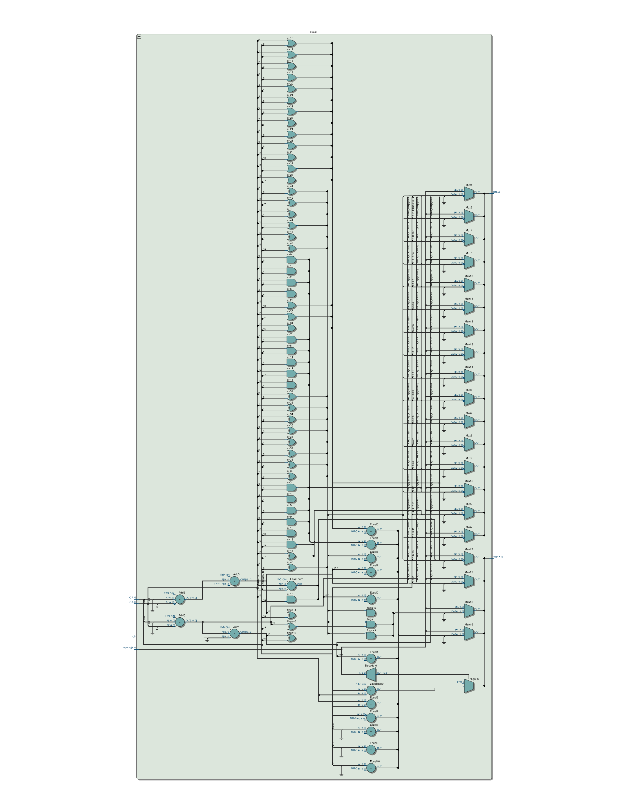
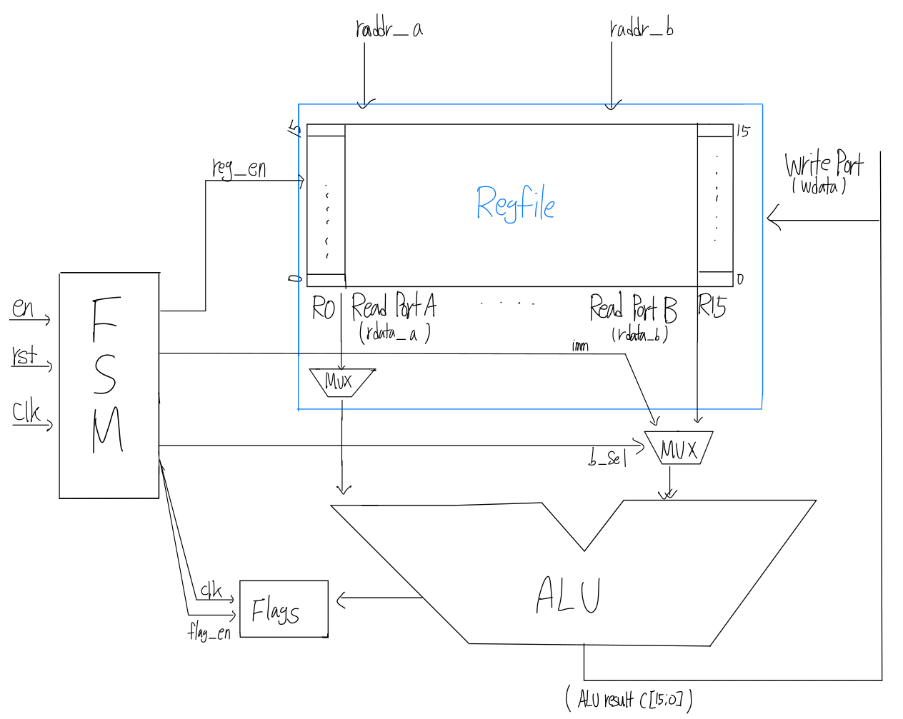
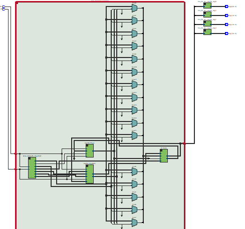

# Lab 2 Report
###### Four Pretty Good Academics (Team 6), 9/20/25

## Introduction

The objective of this lab was to design and implement a 16-register file and integrate it with our previously developed ALU in order to construct a functional datapath capable of performing both arithmetic and logical operations. A central goal was to verify the correct operation of the register file interface and ensure that data could be transferred seamlessly between the register file and the ALU. In addition, we sought to demonstrate this datapath on FPGA hardware to validate its practical feasibility.

To achieve these goals, we developed a register file consisting of sixteen 16-bit registers equipped with read and write ports, enable signals, and control logic. This register file was integrated with the ALU datapath so that operands could be retrieved, processed according to the instruction opcode, and subsequently written back into the designated destination register. To verify correct functionality, we created testbenches that executed a sequence of instructions ranging from logical operations (e.g., AND, OR, XOR) to arithmetic tasks such as Fibonacci sequence generation. These tests were implemented using finite state machines (FSMs), with each state representing an individual instruction in the sequence. Following the simulation, the design was synthesized and prepared for FPGA implementation.

In completing these objectives, we implemented 16-bit registers, a 16-channel register file, and successfully integrated these components with the ALU and system databus. We also refactored the datapath and module structure, updated the ALU opcode definitions, and adopted a MUX-based interface in place of tristate buffering in accordance with recommended design practices.

## ALU Design

Our initial ALU design was based on the instruction set of the EECS 427 RISC Processor. In this design, our ALU took an 8-bit opcode from the combined *opcode* and *extended opcode* fields of the instruction and implemented each operation inside of a large Verilog *casex* statement. We eventually realized that our immediate/non-immediate and signed/unsigned operations were nearly identical and decided to redesign our ALU.

In our new ALU design, we decided to remove any distinction between immediate/non-immediate and signed/unsigned operations, leaving this distinction to our control unit. The ALU takes a 4-bit opcode and the meaning of an operation (whether it is signed or unsigned) is determined by the interpretation of the output flags. The ALU in our current design supports the following operations:

- NOP
- ADD
- ADDC
- SUB
- CMP
- AND
- OR
- XOR
- NOT
- LSH
- RSHL
- RSHA

## ALU Testing

To test our ALU, we wrote a self-checking testbench that checks each operation thousands of times by setting the opcode, setting random inputs, and then verifying the output. If there is an error, the testbench will display the inputs and outputs and a short message to indicate where the problem is.

For example, if a modification to our ALU causes the ADD instruction to incorrectly set the carry flag, then our testbench (when configured to only check each instruction 10 times) could produce an output that looks like the following:

```
VSIM> run -all
# Checking NOP
# Checking ADD
# ERROR (flag c) a:d653 b:dd6b c_in:1 c:b3be flags:01000 time:150
# ERROR (flag c) a:618a b:b341 c_in:0 c:14cb flags:00000 time:190
# ERROR (flag c) a:f378 b:1289 c_in:1 c:0601 flags:00000 time:200
# ERROR (flag c) a:65b6 b:f9c6 c_in:0 c:5f7c flags:00000 time:210
# Checking ADDC
# Checking SUB
# Checking CMP
# Checking AND
# Checking OR
# Checking XOR
# Checking NOT
# Checking LSH
# Checking RSHL
# Checking RSHA
# Done (4 errors)
```

Between the ALU implementation and the self-checking testbench, the expected behavior of our ALU is described in two separate locations. Additionally, our self-checking testbench has checked each ALU operation hundreds of thousands of times with no errors. This makes us confident that our ALU is functioning correctly.

## ALU Synthesis

The ALU synthesis results show that the ALU uses 127 Adaptive Logic Modules (ALMs) and 0 registers. The number of ALMs seems reasonable, and the number of registers is what we expected since we designed our ALU as a combinational module. The netlist of our ALU can be seen here:



The ALU timing analysis produced the following results:

```
Longest paths (rising input to rising output):
  b[1] to c[11] 16.432ns
  b[4] to c[11] 16.432ns
  b[7] to c[11] 16.359ns
  b[2] to c[11] 16.341ns
  b[1] to c[13] 16.318ns

Longest paths (falling input to falling output):
  b[4] to c[13] 17.027ns
  b[4] to c[11] 17.020ns
  b[1] to c[13] 16.996ns
  b[1] to c[11] 16.989ns
  b[4] to c[12] 16.891ns
```

## Regfile Design

We initially implemented our regfile by manually assigning each of the 16 vectors. We later enhanced the readability of this by using the array method mentioned on Canvas:

```verilog
always @(posedge clk or posedge rst) begin
    if (rst) begin
        for (i=0; i<16; i=i+1) r[i] <= 16'h0000;
    end else begin
        for (i=1; i<16; i=i+1) begin
            if (en[i]) r[i] <= wdata;
        end
    end
end
```

## Datapath and Integration

In this lab, we implemented MUXing on the B register to pass Immediates and flags to the ALU. The selector flag has three modes:

```verilog
0:              alu_b = reg_alu_b;  // Use register value
1:              alu_b = imm;        // Use Immediate Value
2:              alu_b = flags_out;  // Use flags register
default:        alu_b = 0;
```



The block diagram shows the integrated datapath for our system, which includes the register file, ALU, flags register, and an FSM for control. Every component has a specific function to perform, but collectively they represent the core of a basic processor-like system that can perform arithmetic and logical operations. Central to the design are the register file, sixteen 16-bit registers (R0–R15), and the operand source for computation. Two read ports and one write port are accommodated, such that two registers can be read simultaneously and results written back to any combination of destination registers. The FSM controls setting the reg_en signal such that writing may be carried out to a selected registers. Read inputs raddr_a and raddr_b select the registers to read, while the wdata input receives the results to be stored. This structure supports proper operand access and data storage in the datapath.

Two multiplexers are placed between the register file and the ALU to manage operand choice. The initial multiplexer allows operand A to be chosen from register data or an immediate value. In comparison, the second multiplexer, which is controlled by the b_sel signal, determines whether operand B comes from register data, an immediate, or from the flags register's output. This MUX-based design sidesteps the tristate buffering headaches and provides a clean and deterministic method for preparing the data to be input to the ALU.

The ALU performs arithmetic and logical operations depending on the opcode determined by the FSM. It accepts operands from the multiplexers, does the calculation, and provides a 16-bit result that is fed back to the register file for storage. At the same time, the ALU alters the flags register, which keeps status bits such as zero, carry, negative, and overflow. Only when the FSM enables flag_en are these flags changed to enable conditional execution and more general data handling. Finally, the FSM is the control unit that generates the signals required to guide the datapath. It manages register enables, selects operands, decides ALU operations, and manages flag updates. Inputs such as the clock (clk), reset (rst), and enable (en) energize the FSM's state transition, which, in turn, connects to a specific instruction or test sequence. When operating, the FSM selects operands from the register file, steers them through the multiplexers, triggers the ALU operation, and stores results in the register file and sets flags as appropriate.

Collectively, this block diagram is the core datapath of a simple CPU. The register file supplies operands, computation is done by the ALU, conditional instructions are aided by the flags register, and the FSM controls the overall process. While this design is not complete with memory access and instruction decode added, it is a good base to build on in support of a complete processor.

## Simulation testing strategy

We implemented tests as hard-coded finite state machines in the control unit. One tests every ALU instruction, two test that flags operate correctly with various operations, and the last performs a Fibonacci calculation across every register. Here's a snippet:

```verilog
/* set all outputs to default */

case (state)

    /* ... */

    2: begin
        /* r[3] <- 0x8000 */
        reg_en[3] = 1;
        reg_a = 0;
        imm = 16'h8000;
        b_sel = 1;
        opcode = `ADD;
    end
    3: begin
        /* r[1] add r[2] */
        reg_a = 1;
        reg_b = 2;
        b_sel = 0;
        opcode = `ADD;
        flag_en = 1;
    end
    4: begin
        /* r[4] <- flags */
        reg_en[4] = 1;
        reg_a = 0;
        b_sel = 2;
        opcode = `ADD;
    end

    /* ... */

endcase
```

## Synthesis Statistics

### 1. Introduction

The synthesis process translates our partial CPU design into a gate-level representation suitable for implementation on an FPGA. This step offers critical insight into how efficiently the design is onto the hardware. By examining key points such as logic utilization, register count, I/O usage, and processor load during compilation, we can detect inefficiencies and determine whether the current design is well-suited for the chosen FPGA platform.

This section focuses on interpreting synthesis statistics gathered from our project implementation. The primary objective is to analyze these results—supported by testbenches—to identify potential areas for improvement. We will evaluate the advantages and limitations of the current design, and relate these findings back to specific modules within our datapath.

### 2. Logic Utilization

From the synthesis summary, the logic utilization is:

- 273 Adaptive Logic Modules (ALMs)
- 356 Adaptive Look-Up Tables (ALUTs)

This indicates that our design is relatively light, consuming only a few hundred logic elements—well within the available capacity of the target FPGA board.

The ALUT usage is distributed as follows:

- 7-input functions: 4
- 6-input functions: 159
- 5-input functions: 81
- 4-input functions: 50
- ≤3-input functions: 62

This breakdown highlights that the majority of the logic (specifically the 159 six-input functions) stems from operations that involve more complex logic combinations. These are most likely associated with the Arithmetic Logic Unit (ALU) operations and register selection multiplexers, which tend to require wider input buses and more complex control signals. Understanding this distribution helps us pinpoint which parts of the design are the most logic-concentrated.

### 3. Register Usage

The design uses:

- 266 Dedicated Logic Registers

From the register statistics:

- All 266 use asynchronous clear
- 261 of them also use clock enable

This indicates that the majority of the registers in the design are capable of being both reset and selectively enabled. This aligns with our datapath and integration design mentioned previously. Furthermore, the register file contains 256 registers and the remaining registers are used in the FSM, ALU flags, and datapath signals.

### 4. I/O Pins

The synthesis tool reports 30 I/O pins used.
These correspond to:
- Inputs: clk, rst, instruction signals, register addresses, immmediate values
- Outputs: ALU results and flags

This confirms the design was integrated correctly as the lab was asked to.

### 5. RTL-Level Design



Given above, this is the schematic of our datapath.
The schematic includes:

Inputs:
- clk, rst

Outputs:
- seg3[0:6] – Seven-segment display output for the upper 4 bits (out[15:12])
- seg2[0:6] – Seven-segment display output for bits (out[11:8])
- seg1[0:6] – Seven-segment display output for bits (out[7:4])
- seg0[0:6] – Seven-segment display output for the lower 4 bits (out[3:0])

The schematic illustrates the internal datapath components. Registers are accessed through read and write addressing, ensuring that data is stored and retrieved from the correct locations. Multiplexers select which values are forwarded to the ALU for computation or written back to registers. The ALU performs operations based on control signals and updates flags automatically to reflect the results. Finally, the output bus routes the computed values to display the seven segment. Overall, this organization of registers, ALU, flags, and routing matches the structure and data flow shown in our diagram.

## Conclusion and Future Prospects

We have implemented arithmetic operations, a register file, and the interface for our control unit. We have yet to implement most memory-related instructions such as LOAD, STOR, and JAL. Once we implement memory and a procedure stack, we are prepared to start writing real programs.

Now that we have the basic operation of our computer, we are beginning to think about the application that we want to build. Here is a short list of applications our team has expressed interest in:

- A Forth compiler
- Floating point operations
  - Particularly involving the [Posit](https://en.wikipedia.org/wiki/Unum_(number_format)#Posit_(Type_III_Unum)) number format
- A basic 3D renderer (a rasterizer or raymarcher)
- Pipelining?
