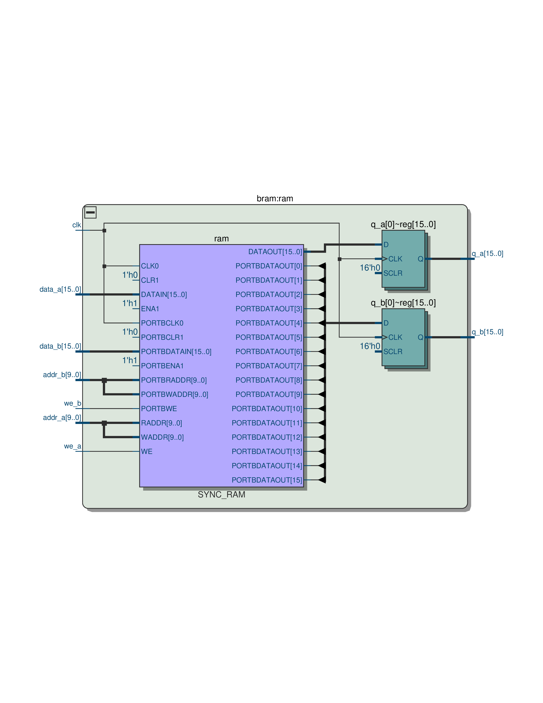
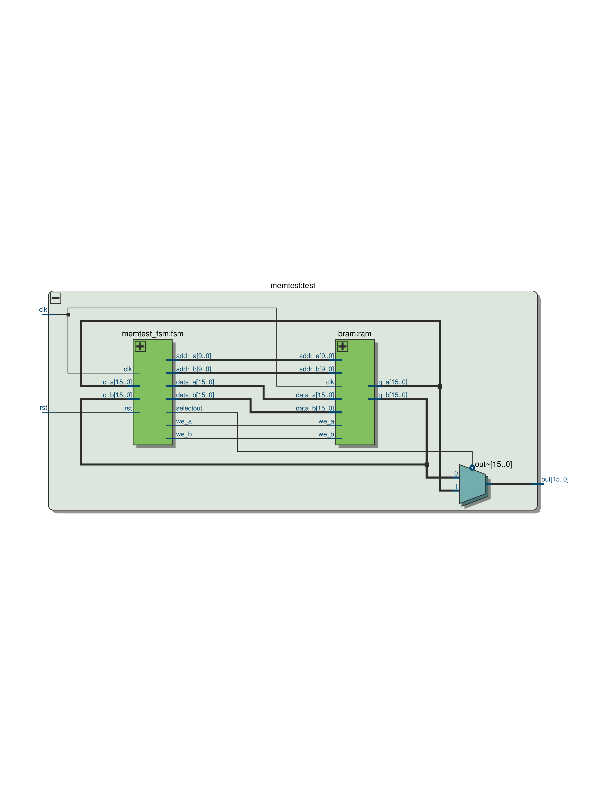
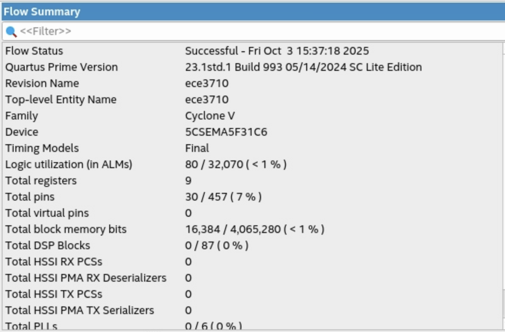

# Lab 3 Report
###### Four Pretty Good Academics (Team 6), 10/3/25

## Introduction

In this lab, we designed a memory access interface for our CPU using the on-chip block-RAM. Our memory access interface has two synchronous ports for reading and writing to our block-RAM. Our block-RAM is a synchronous true dual-port memory. It uses the read-with-write configuration and has parameters for the data width, address width, and the memory initialization file. The objective was to confirm that memory transactions (read, modify, write, re-read) work correctly and that the synthesized hardware infers FPGA block-RAMs as expected.

## Block-RAM Testing

To test our block-RAM, we instantiated our block-RAM module using a 16-bit data width and a 10-bit address width, which should synthesize two 16-bit by 512-word blocks of RAM on our board. The netlist of our synthesized block-RAM is shown here:

Then, we implemented a FSM that reads the first and last two words in each block of RAM, adds the address of the word to the word, writes it back, and then reads the updated value. Our memory initialization file was setup so that the values read back after each read-modify-write-read operation would be 0x400. The netlist of our memory test is shown here:

## Synthesis Statistics

### 1. Logic Utilization

From the synthesis summary, the logic utilization is:

- 80 Adaptive Logic Modules (ALMs)
This represents only a very small portion of the available logic, showing that most of the design functionality is handled by dedicated Block RAM instead of combinational logic. The ALMs are mainly used by the FSM controller (memtest_fsm.v) and the supporting glue logic responsible for address, write-enable, and data signal management.

### 2. Register Usage

- 9 total registers
The design requires only a small number of registers, primarily for FSM state encoding and write operation synchronization. This aligns with expectations, as the memory array is implemented in the BRAM.

### 3. Block Memory Usage

- 16,384 / 4,065,280 available
- Implemented using 2 Block RAMs

The memory report shows that a true dual-port BRAM was correctly inferred, with 16-bit data width and 10-bit address depth (1024 words). This matches the settings in bram.v and confirms our goal of using on-chip RAM instead of distributed registers.

## Conclusion

In this lab, we successfully implemented and validated a memory access interface using BRAM and an FSM-based testing strategy. Our results show that the memory module operates correctly under read, write, and verify cycles. This work completes the datapath foundation: Lab 2 provided computation and register storage, and Lab 3 now provides memory access.
