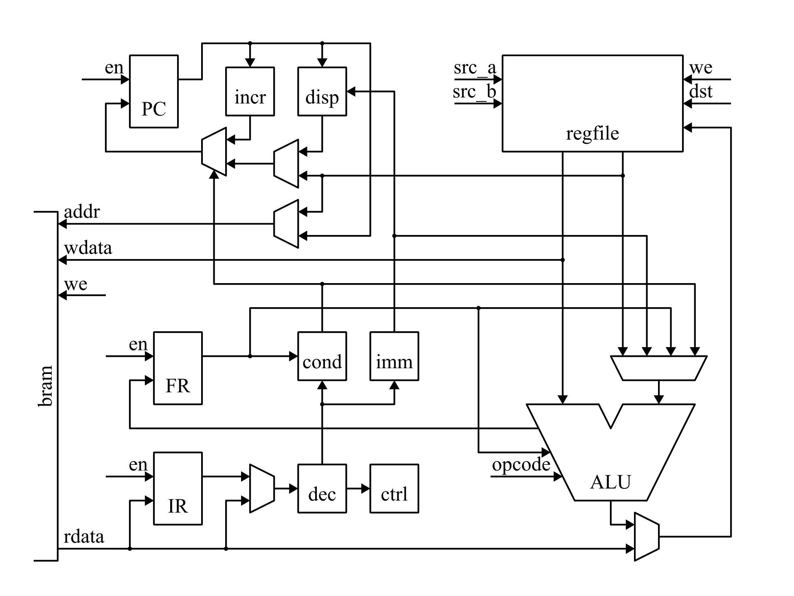
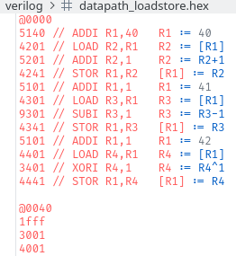

# Lab 4 Report
###### Four Pretty Good Academics (Team 6), 11/14/25

## Introduction

The objective of this lab was to complete the implementation of the datapath and control for our CPU. This involved connecting the instruction decoder, program counter, and control FSM to the ALU, register file, and memory components that we had previously built in earlier labs. Once these pieces were integrated, the CPU became capable of fetching instructions from memory and stepping through arithmetic operations, loads and stores, flag updates, and conditional branches. By completing this integration in both simulation and on the DE1-SoC, we now have a functioning processor that can run simple programs and sets the stage for adding features like I/O and VGA support in the future.

## CPU Interface

Our CPU implements three kinds of instructions. These are register-to-register instructions, memory load instructions, and memory store instructions. Register-to-register and memory store instructions take three clock cycles to execute, and memory load instructions take four clock cycles to execute.

Our CPU reads and writes 16-bit words from a block-RAM. Instructions are read from memory during the first and second clock cycles of an instruction. During a load instruction data is read from memory on the third clock cycle. The program counter, register file, and memory are all written back to during the last clock cycle of an instruction.

Our CPU currently implements the following instructions: ADD, ADDI, ADDC, ADDCI, SUB, SUBI, CMP, CMPI, AND, ANDI, OR, ORI, XOR, XORI, MOV, MOVZI, MOVSI, MOVUI, LSHI, ASHI, LOAD, STOR, Scond, Bcond, Jcond, and WAIT.

## CPU Design

The datapath of our CPU is shown here:

The datapath is controlled by a Finite-State Machine (FSM). The FSM is responsible for enabling the write-enable signals of the different registers and memory.

Instructions are decoded by a combinational decoder module. This module is responsible for extracting immediate values, condition codes, and register selects from the instruction. It also configures most of the datapath and tells the FSM which instruction type to execute.

Our CPU has an instruction register that is loaded on the second clock cycle of every instruction. The stored instruction is used by the load instruction while data is loaded from memory on the third clock cycle.

Our CPU has a 16-bit unsigned program counter that is updated on the last clock cycle of every instruction. When the program counter is updated, it is either incremented or loaded with a new value. The loaded value is either the program counter plus an 8-bit 2's complement branch displacement or a 16-bit absolute address stored in a register.

For regular PC incrementation (that is, not in a JUMP), we wrote a module called `incr` to increment the PC. Whenever the PC is enabled, it receives a value that already exists in a bus. For conditional jumps, we wrote a module called `cond` to decode the condition and check it.

The state-transition-graph of our CPU control FSM is shown below. Each of the below states corresponds to one cycle of execution:

## Datapath Testing

We wrote 3 test programs for each type of instruction. These tests demonstrate working operation of the datapaths, along with the instructions themselves.

After finalizing the datapath, we were able to write a simple assembler to save the effort of writing machine code in our final project.

## Synthesis Statistics

We synthesized our full system (CPU + VGA controller + glyph ROM) using Intel Quartus Prime. The key results are summarized below.
### 1. Logic Utilization
* 439 Adaptive Logic Modules (ALMs) used out of 32,070
* ≈ 1% of total device logic
* ALM usage comes from:
    * CPU datapath, including the ALU, register file interface, memory address/data path, and the internal multiplexers needed to route operands
    * Instruction decoder, which generates all combinational control signals
    * Control FSM, which drives the register-enable and memory-enable signals for each clock cycle of instruction execution
    * Program counter update logic, which handles PC increments and branch/jump target selection
    * VGA controller, including horizontal/vertical timing counters, sync generation, and glyph address generation
* The system remains very lightweight even with the VGA subsystem included.
### 2. Register Usage
* 325 logic registers used
* Register sources include:
    * Program Counter
    * FSM state registers
    * ALU flags
    * Register file write-back controls
    * VGA hCount and vCount counters
* Most registers use asynchronous reset and clock enable, matching our control design.
### 3. Block Memory Usage
* 1,048,576 / 4,065,280 block RAM bits used (≈ 26%)
* Implemented using 2 Block RAMs
* Primary contributors to memory usage:
    * Glyph ROM for the VGA text rendering system
    * CPU instruction/data memory (much smaller in comparison)
* The glyph ROM dominates the memory footprint, which is expected for character-based VGA designs.
### 4. I/O Usage
* 30 / 457 I/O pins used (≈ 7%)
* Pin usage corresponds to:
    * clk and rst
    * VGA outputs: RGB signals, hSync, vSync
    * Optional debug pins and 7-segment display lines
* Confirms proper integration of the VGA subsystem with the CPU.
### 5. Summary
* The system uses very few logic and register resources, even with VGA included.
* Block RAM is the largest resource consumer due to glyph storage.

## Conclusion

In this lab, we finished implementing the datapath and control of our baseline CPU. In the future, we will need to extend our CPU with input/output (IO) capabilities so that we can interface with our PS/2 keyboard and VGA display peripherals. We can do this by adding special-purpose instructions or by reserving parts of our 16-bit address space for memory-mapped IO. We will also need to decide if we would like to implement special stack instructions for our FORTH interpreter or if we would like to do this in software.

#### Team Member Contributions
Not exhaustive.

- Byron: Wrote assembler, first implementation of branch condition checker and R-type decoding, writing for this report
- Luke: Wrote test programs, revised datapath for Jump instruction, refactored decode module, made diagrams for this report
- Sean: Wrote VGA implementation, updated the decode and control modules 
- Matt: Revised the decode and memory FSM module, updated the load/store test
